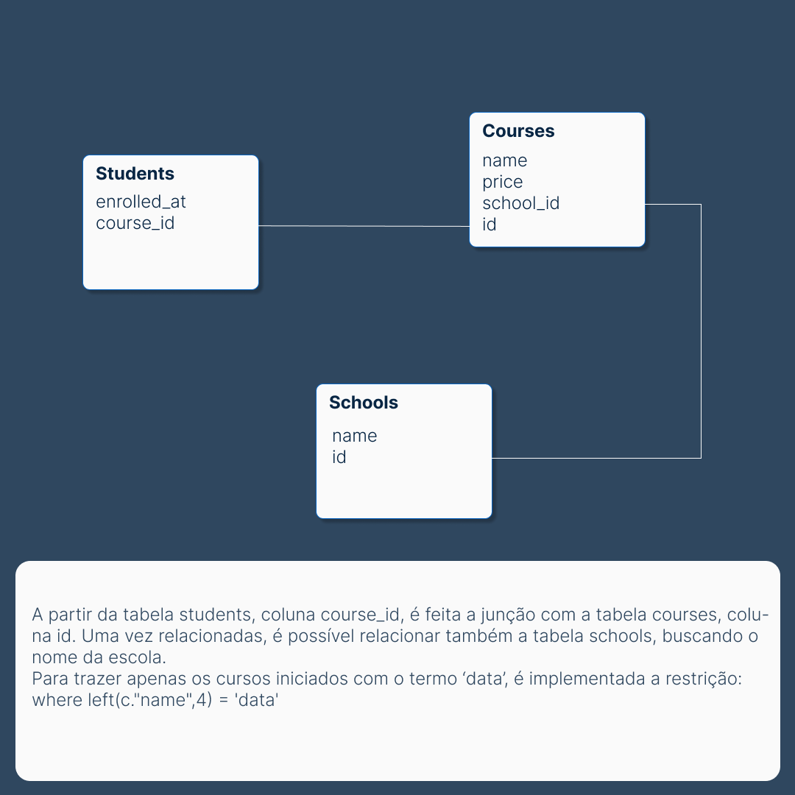
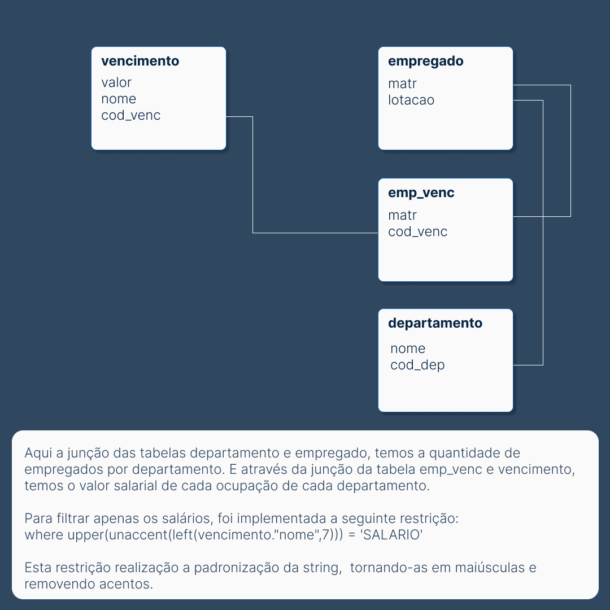

## Análise de dados PostgresSQL.

### questão 1.

Com base nas tabelas existentes nesse projeto, aqui serão feitas a seguintes análises:

Dadas as 3 tabelas:
- students: (id int, name text, enrolled_at date, course_id text)
- courses: (id int, name text, price numeric, school_id text)
- schools: (id int, name text)
a. 
* Quantidade de alunos por escola e por dia
* Valor total das matríuculas
Apenas os cursos que iniciam com o termo 'data', ordenado por dia mais recente para o mais antigo.

b. (com base no resultado de a.)
* a soma acumulada
* a média móvel 7 dias e a média móvel 30 dias (quantidade de alunos)
* a média móvel 7 dias e a média móvel 30 dias (valor de matrícula)

### questão 2.
* a quantidade de empregados, a média salarial, o maior e o menor salários por departamento.
* ordenados pela maior média salarial.

### Passos para executar o projeto.
Após clonar o repositório, verifique se as pastas temp, backups e source estão presentes no diretório; Se não crie-as.
Crie dentro da pasta app, um arquivo chamado .env, com o conteúdo abaixo, editando os caminhos das pastas source, temp e backups: <br>
```
AIRFLOW_UID=50000
AIRFLOW_GID=0
AIRFLOW_PORT=8080

DATA_DIRECTORY='aqui o caminho para a pasta source'
TEMP_DIRECTORY='aqui o caminho para a pasta temp'
BACKUP_DIRECTORY='aqui o caminho para a pasta backups'

DATA_DIRECTORY_CONTAINER='/app/data'
TEMP_DIRECTORY_CONTAINER='/app/data/temp_data'
BACKUP_DIRECTORY_CONTAINER='/app/backups'
```

As pastas logs, plugins e config também são indispensáveis. 

cd app
docker compose -f airflow-docker-compose.yaml up   

### Resolução.

**Questão 1.**



**Questão 2.** <br>


